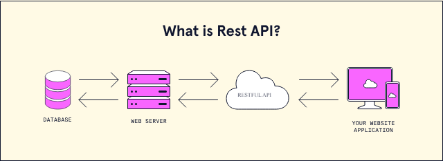
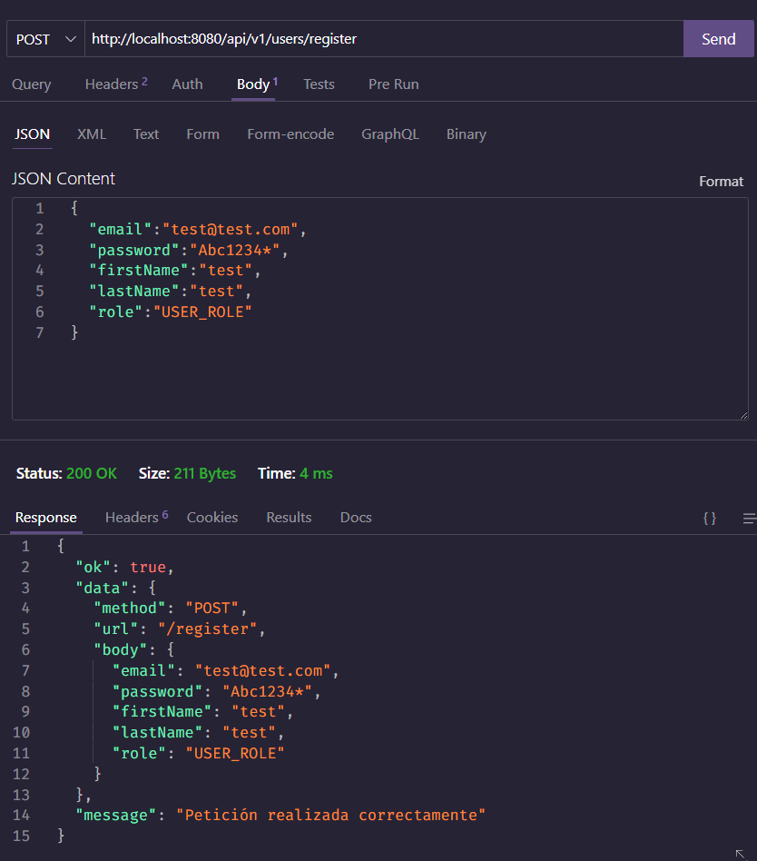

# Design Paterns (Patrones de diseño)

En desarrollo, un patrón de diseño es una solución general reutilizable a un problema común dentro de un contexto dado en el diseño de software. Un patrón de diseño no es un diseño terminado que se puede transformar directamente en código fuente o código de máquina. Es una descripción o plantilla de cómo resolver un problema que se puede utilizar en muchas situaciones diferentes. Los patrones de diseño son las mejores prácticas formales que un programador puede usar para resolver problemas comunes cuando se diseña una aplicación o un sistema.

Los patrones de diseño pueden acelerar el proceso de desarrollo al proporcionar paradigmas de desarrollo probados y probados.

Uno de los más conocidos y que mencionaremos en este material es el patrón de diseño MVC (Modelo, Vista y Controlador).

## MVC

El patrón de diseño MVC (Modelo, Vista y Controlador) es un patrón de diseño de software arquitectónico comúnmente utilizado para desarrollar interfaces de usuario que divide una aplicación en tres partes interconectadas. Esto se hace para separar representaciones internas de información de la forma en que se presenta al usuario.

El patrón de diseño MVC separa estos componentes principales que permiten la reutilización del código y el desarrollo paralelo. Los componentes son:

- **Modelo**: El modelo es la representación de la información con la que el sistema opera. Por lo general, recupera y almacena datos de una base de datos.
- **Vista**: La vista es la representación visual de la información con la que el usuario interactúa. Generalmente, es una página web, una pantalla o una parte de ella y muy comunmente usamos ***motores de plantillas*** con lenguajes de programación como PHP, Python, Ruby o JavaScript.
- **Controlador**: El controlador es responsable de recibir las solicitudes del usuario y llamar al modelo y la vista apropiados para manejarlas (en el caso de MVC). El controlador es el responsable de manejar las solicitudes del usuario y construir una respuesta para ellos.

Nosotros vamos a aplicar parte del patrón MVC para nuestra API REST, en donde el modelo y la vista serán reemplazados por el controlador y el modelo de datos.

Es decir que tendremos la siguiente estructura:

- Modelo de datos: `models.js`
- Controlador: `controllers.js`

A este patrón se le conoce como ***MVC ligero***, ya que no se tiene una vista, sino que se tiene un controlador que se encarga de recibir las peticiones y enviar las respuestas. En este caso, la vista será el cliente que consuma la API REST.

## API REST

Una API REST es una API que se basa en el protocolo HTTP y que utiliza sus métodos para realizar las operaciones CRUD (Create, Read, Update, Delete) sobre los datos. Es decir, que para realizar una operación sobre los datos, se debe utilizar un método HTTP específico.

| Método | Operación |
| ------- | ---------- |
| GET     | Leer       |
| POST    | Crear      |
| PUT     | Actualizar |
| DELETE  | Eliminar   |

Por ejemplo, para obtener todos los usuarios, se debe utilizar el método `GET` sobre la ruta `/users`. Para obtener un usuario en específico, se debe utilizar el método `GET` sobre la ruta `/users/:id`. Para crear un usuario, se debe utilizar el método `POST` sobre la ruta `/users`. Para actualizar un usuario, se debe utilizar el método `PUT` sobre la ruta `/users/:id`. Para eliminar un usuario, se debe utilizar el método `DELETE` sobre la ruta `/users/:id`.

También se le conoce como ABM (Alta, Baja y Modificación) o CRUD (Create, Read, Update, Delete).

## API RESTful

Una API RESTful es una API REST que cumple con ciertas características, como por ejemplo:

- Utiliza los métodos HTTP de forma correcta.
- Utiliza los códigos de estado HTTP de forma correcta.
- Utiliza los tipos de contenido HTTP de forma correcta.
- Envía las respuestas en formato JSON (JavaScript Object Notion).



## Creando un Router para nuestra API REST

Como podemos ver, nuestra API REST va a tener varias rutas, por lo que es necesario crear un router para manejarlas. Para ello, debemos crear un archivo llamado `user.routes.js` dentro de la carpeta `routes` y añadir el siguiente código:

```js
// importo express
const express = require('express');
// creo un router a partir de express
const router = express.Router();

// creo mi ruta
// http://localhost:8080/api/v1/users/register
router.post('/register', ( req, res )=>{

    return res.status(200).json({
        ok: true,
        data:{
            method: req.method,
            url: req.url,
            body: req.body
        },
        message: 'Petición realizada correctamente'
    });

})

// exporto el router para utilizarlo en otros archivos
module.exports = router;
```

## Añadiendo el router a nuestra API REST

Para añadir el router a nuestra API REST, debemos importarlo en el archivo `index.js` y añadirlo como un middleware. Para ello, debemos añadir el siguiente código:

```js
// configuración de dotenv (variables de entorno)
require('dotenv').config()

// 1. Importamos la librería de express
const express = require('express');

// 2. Creamos una instancia de express
const app = express(); // app es una instancia de express

// Importamos la conexión a la base de datos y ejecutamos la función
const connectDB = require('./src/config/mongoose')
connectDB();

// Convertir el json del body en un objeto de javascript
app.use(express.json()); // Middleware

// app es un objeto que tiene métodos, uno de ellos es get el cual recibe dos parámetros (ruta, callback)
// * un callback es una función que se pasa por parámetro a otra función.

// 3. Definimos las rutas de nuestra aplicación de forma agrupada
app.use('/api/v1/users', require('./src/routes/user.routes'))

const PORT = 8080; // PORT será una constante que contendrá el número de puerto en el que va a escuchar el servidor

// 4. Definimos el puerto en el que va a escuchar el servidor
app.listen( PORT, ()=>{
    console.log(`Servidor escuchando en el puerto ${PORT}`)
})
```

- *3* Como se puede apreciar en el código anterior, el método `use` de express, recibe dos parámetros, el primero es la ruta y el segundo es el middleware que se va a ejecutar cuando se haga una petición a esa ruta. En este caso, el middleware es el router que creamos anteriormente.

* **Nota**: El orden de los middlewares es importante, ya que se ejecutan de forma secuencial.

## Probando nuestra API REST con Thunder Client

Usaremos Thunder Client para probar nuestra API REST. Para ello, debemos instalar la extensión de Thunder Client en Visual Studio Code.



Una vez instala la extensión, debemos hacer clic en el botón de Thunder Client que se encuentra en la parte inferior izquierda de Visual Studio Code y seleccionar la opción `New Request`.

Es la parte superior ingresaremos la ruta y seleccionaremos el método HTTP que queremos utilizar.

## Añadiendo el controlador a nuestra API REST

Tener la lógica de negocio en el router no es una buena práctica, por lo que debemos crear un controlador para manejar la lógica de negocio de nuestra API REST. Es decir, separar la lógica de negocio de la lógica de las rutas.

Para añadir el controlador a nuestra API REST, debemos crear un archivo llamado `user.controllers.js` dentro de la carpeta `controllers` y añadir el siguiente código:

```js
// importo response de express para tener autocompletado
const { response } = require('express');

// importo mi modelo de usuario
const User = require('../models/User');


// creo mi controlador de usuarios
const createUser = async (req, resp = response) => {
    try{

        // TODO: Encriptar la contraseña

        const newUser = await User.create(req.body) 

        // elimar el password
        newUser.password = undefined;

        return resp.status(201).json({
            ok: true,
            data: newUser,
            message: 'Usuario creado correctamente'
        })

    }catch(err){
        console.log(err);
        return resp.status(500).json({
            ok: false,
            message: 'Error interno del servidor'
        })
    }
};

module.exports = {
    createUser
}

```

Luego de crear el controlador, debemos importarlo en el router y añadirlo como un middleware. Para ello, debemos añadir el siguiente código:

```js
// importo express
const express = require('express');
// importo mi controlador de usuarios
const { createUser } = require('../controllers/user.controllers');
// creo un router a partir de express
const router = express.Router();

// creo mi ruta
// http://localhost:8080/api/v1/users/register
router.post('/register', createUser)

// exporto el router para utilizarlo en otros archivos
module.exports = router;
```
