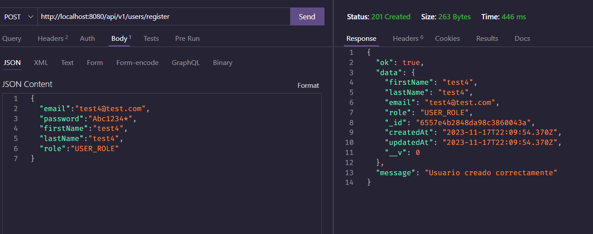
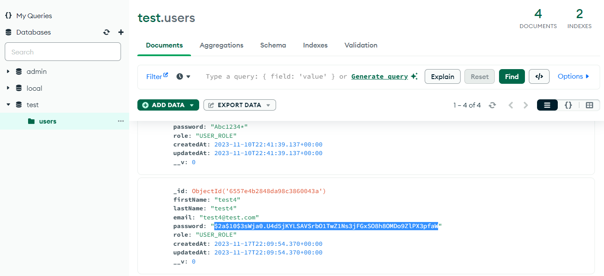
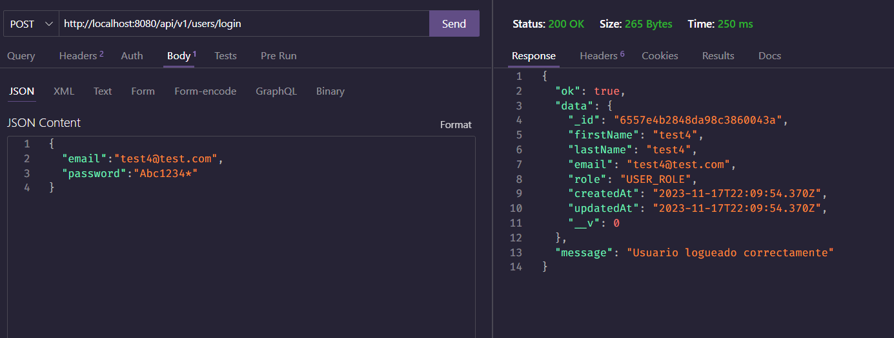

# Credenciales

La REST API que estamos creando, debe tener un sistema de autenticación para que los usuarios puedan acceder a los recursos que necesiten. Para ello, vamos a utilizar un sistema de autenticación basado en tokens, utilizando el paquete `jsonwebtoken`.

## Protección de contraseñas

Sin embargo, antes de eso vamos a proter las contraseñas del usuario utilizando el paquete `bcryptjs`. Para ello, debemos instalar el paquete con el siguiente comando:

```bash
npm install bcryptjs
```

### Encriptación de contraseñas

Para encriptar las contraseñas, vamos a crear un archivo `utils/bcrypt.js` con el siguiente contenido:

```js
const bcrypt = require('bcryptjs');

const encryptPassword = async (password) => {
  const salt = await bcrypt.genSalt(10); // salt es un string aleatorio que se añade a la contraseña para hacerla más segura
  return await bcrypt.hash(password, salt); // Devuelve la contraseña encriptada
};

module.exports = encryptPassword;
```

Posteriormente, en el archivo `controllers/users.controllers.js` vamos a importar la función `encryptPassword` y la vamos a utilizar en la ruta de registro de usuarios:

```js
// importo response de express para tener autocompletado
const { response } = require('express');

// importo mi modelo de usuario
const User = require('../models/User');

// importo mi función de encriptación
const encryptPassword = require('../utils/bcrypt');

// creo mi controlador de usuarios
const createUser = async (req, resp = response) => {
    try{

        // TODO: Encriptar la contraseña
        const password = await encryptPassword(req.body.password);
        req.body.password = password; // reemplazo la contraseña por la encriptada

        const newUser = await User.create(req.body) 

        // elimar el password
        newUser.password = undefined;

        return resp.status(201).json({
            ok: true,
            data: newUser,
            message: 'Usuario creado correctamente'
        })

    }catch(err){
        console.log(err);
        return resp.status(500).json({
            ok: false,
            message: 'Error interno del servidor'
        })
    }
};

module.exports = {
    createUser
}

```

Ahora vamos a volver a probar usando Thunder Client:



Lo que veremos en la base de datos será la contraseña encriptada:




### Login de usuario y comparación de contraseñas

Para esta sección vamos a implementar una ruta para login usando un contralador de login que se encargará de verificar que el usuario exista y que la contraseña sea correcta. Para ello, vamos a crear una función `loginUser` en el archivo `controllers/user.controllers.js`:

```js
// importo response de express para tener autocompletado
const { response } = require("express");

// importo mi modelo de usuario
const User = require("../models/User");

const bcrypt = require("bcryptjs");

// importo mi función de encriptación
const encryptPassword = require("../utils/bcrypt");

// creo mi controlador de usuarios
const createUser = async (req, resp = response) => {
  try {
    // TODO: Encriptar la contraseña
    const password = await encryptPassword(req.body.password);
    req.body.password = password; // reemplazo la contraseña por la encriptada

    const newUser = await User.create(req.body);

    // elimar el password
    newUser.password = undefined;

    return resp.status(201).json({
      ok: true,
      data: newUser,
      message: "Usuario creado correctamente",
    });
  } catch (err) {
    console.log(err);
    return resp.status(500).json({
      ok: false,
      message: "Error interno del servidor",
    });
  }
};

const loginUser = async (req, resp = response) => {
  try {

    // 1. Verificar si el usuario existe
    const user = await User.findOne({ email: req.body.email });

    // si el usuario  no existe, user será null
    if (!user) {
      return resp.status(400).json({
        ok: false,
        message: "Usuario o contraseña incorrectos",
      });
    }

    // 2. Verificar si la contraseña es correcta
    // req.body.password es la contraseña que viene en el body de la petición

    // comparar la contraseña que viene en el body con la contraseña que está en la base de datos

    const passwordIsValid = await bcrypt.compare(req.body.password, user.password);

    if(!passwordIsValid){
      return resp.status(400).json({
        ok: false,
        message: "Usuario o contraseña incorrectos",
      });
    }

    // 3. TODO: Generar el token


    // eliminar el password
    user.password = undefined;

    return resp.status(200).json({
      ok: true,
      data: user,
      message: "Usuario logueado correctamente",
    });


  } catch (err) {
    console.log(err);
    return resp.status(500).json({
      ok: false,
      message: "Error interno del servidor",
    });
  }
};

module.exports = {
  createUser,
};

```

Ahora vamos a agregar la ruta de login en el archivo `routes/users.routes.js`:

```js
// importo express
const express = require('express');
// importo mi controlador de usuarios
const { createUser, loginUser } = require('../controllers/user.controllers');
// creo un router a partir de express
const router = express.Router();

// creo mi ruta
// http://localhost:8080/api/v1/users/register
router.post('/register', createUser);

// http://localhost:8080/api/v1/users/login
router.post('/login', loginUser);

// exporto el router para utilizarlo en otros archivos
module.exports = router;
```

Ahora vamos a probar la ruta de login usando Thunder Client:


