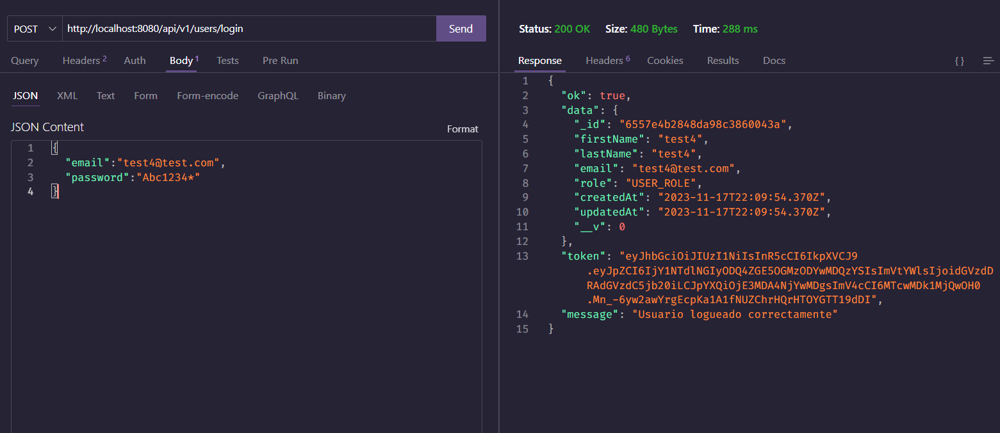
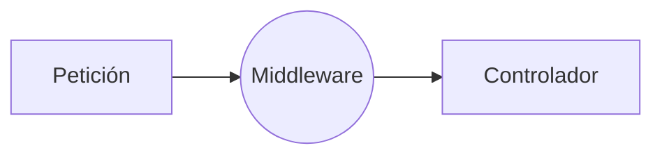

# JWT

Si bien tener o contar con la contraseña y el usuario es una forma de autenticación, esta es una condición necesaria pero no suficiente. Es decir, no es suficiente con que el usuario y la contraseña sean correctos, sino que además, el usuario debe poder demostrar en cada petición que es quien dice ser. Un ejemplo en la vida real es cuando vamos a un recital y nos piden la entrada, la entrada es la prueba de que somos quienes decimos ser, sin embargo una vez que hemos provisto la entrada, no nos la vuelven a pedir en cada canción, sino que nos colocan una pulsera que nos identifica como asistentes al recital. Esto hace que podamos entrar y salir del recital sin tener que volver a mostrar la entrada, pero si en algún momento nos la piden, debemos poder mostrarla.

En el mundo de las aplicaciones web, el equivalente a la entrada es el usuario y la contraseña, y el equivalente a la pulsera es el token de autenticación. El token de autenticación es un objeto que se genera una vez que el usuario se ha autenticado, y que contiene la información necesaria para que el servidor pueda identificar al usuario en cada petición. El token de autenticación se envía en cada petición, y el servidor lo utiliza para identificar al usuario.

## ¿Qué es JWT?

JWT es un estándar abierto (RFC 7519) que define una forma compacta y autónoma para transmitir de forma segura información entre partes como un objeto JSON. Esta información puede ser verificada y confiable porque está firmada digitalmente. Los JWT se pueden firmar utilizando un secreto (con el algoritmo HMAC) o un par de claves pública / privada utilizando RSA o ECDSA.

## ¿Cómo funciona?

En términos generales, el flujo de autenticación con JWT es el siguiente:

1. El cliente envía las credenciales (usuario y contraseña) al servidor.
2. El servidor autentica las credenciales y genera un token de autenticación.
3. El servidor envía el token de autenticación al cliente.
4. El cliente almacena el token de autenticación y lo envía en cada petición.
5. El servidor verifica que el token de autenticación sea válido y autoriza la petición.
6. El servidor procesa la petición y devuelve una respuesta.
7. El cliente recibe la respuesta y la procesa.
8. El cliente puede solicitar recursos adicionales al servidor, enviando el token de autenticación en cada petición.    

**Cliente:** Es la aplicación que se comunica con el servidor. En el caso de una aplicación web, el cliente es el navegador.

**Servidor:** Es la aplicación que provee los recursos al cliente. En el caso de una aplicación web, el servidor es el backend o API REST.

## ¿Cómo se ve un JWT?

Un JWT se ve de la siguiente manera:

```bash
eyJhbGciOiJIUzI1NiIsInR5cCI6IkpXVCJ9.
eyJzdWIiOiIxMjM0NTY3ODkwIiwibmFtZSI6IkpvaG4gRG9lIiwi
YWRtaW4iOnRydWV9.
```

Un JWT se compone de tres partes separadas por un punto (.):

1. **Header:** Contiene el tipo de token y el algoritmo de encriptación.
   ejemplo:
   
   ```json
   {
     "alg": "HS256",
     "typ": "JWT"
   }
   ```
2. **Payload:** Contiene la información del usuario.
    ejemplo:
    
    ```json
    {
      "sub": "1234567890",
      "name": "John Doe",
      "admin": true
    }
    ```
3. **Signature:** Contiene la firma del token que permite verificar que el token no ha sido modificado.


## ¿Cómo se genera un JWT?

Para generar un JWT, se debe utilizar un algoritmo de encriptación, una clave secreta y la información del usuario. El algoritmo de encriptación y la clave secreta se utilizan para generar la firma del token, y la información del usuario se utiliza para generar el payload. El header se genera automáticamente y se agrega al token.

## Implementación de JWT en nuestra API REST

Para implementar JWT en nuestra API REST, vamos a utilizar la librería [jsonwebtoken](https://www.npmjs.com/package/jsonwebtoken) de Node.js. Esta librería nos permite generar y verificar JWT de forma sencilla.

Para instalar la librería, ejecutamos el siguiente comando:

```bash
npm install jsonwebtoken
```

Una vez instalada la librería, vamos a crear un archivo llamado `jwt.js` en la carpeta `src/utils` con el siguiente contenido:

```javascript
// importamos la librería jsonwebtoken
const jwt = require('jsonwebtoken');

// creamos una función para generar el token
const generateToken = (payload) => {
    // generamos el token con el método sign, el cual recibe el payload, la clave secreta y el tiempo de expiración
    const token = jwt.sign(payload, process.env.JWT_SECRET, { expiresIn: '1d' });
    // retornamos el token
    return token;
}

// creamos una función para verificar el token
const verifyToken = (token) => {
    // verificamos el token con el método verify, el cual recibe el token y la clave secreta
    const decoded = jwt.verify(token, process.env.JWT_SECRET);
    // retornamos el token decodificado
    return decoded;
}


// exportamos las funciones
module.exports = {
    generateToken,
    verifyToken
}
```

En el archivo `jwt.js` hemos creado dos funciones, una para generar el token y otra para verificar el token. Ambas funciones reciben un parámetro, el cual es el payload del token. El payload es la información que queremos almacenar en el token, en nuestro caso, el payload es el usuario.

## En qué momento se genera el token

El token se genera una vez que el usuario se ha autenticado. Para ello, vamos a modificar el archivo `src/controllers/auth.controller.js` de la siguiente manera:

```javascript
// importo response de express para tener autocompletado
const { response } = require("express");

// importo mi modelo de usuario
const User = require("../models/User");

const bcrypt = require("bcryptjs");

// importo mi función de encriptación
const encryptPassword = require("../utils/bcrypt");
// importo mi función de generación de token
const { generateToken } = require("../utils/jwt");

// creo mi controlador de usuarios
const createUser = async (req, resp = response) => {
  try {
    // TODO: Encriptar la contraseña
    const password = await encryptPassword(req.body.password);
    req.body.password = password; // reemplazo la contraseña por la encriptada

    const newUser = await User.create(req.body);

    // elimar el password
    newUser.password = undefined;

    return resp.status(201).json({
      ok: true,
      data: newUser,
      message: "Usuario creado correctamente",
    });
  } catch (err) {
    console.log(err);
    return resp.status(500).json({
      ok: false,
      message: "Error interno del servidor",
    });
  }
};

const loginUser = async (req, resp = response) => {
  try {

    // 1. Verificar si el usuario existe
    const user = await User.findOne({ email: req.body.email });

    // si el usuario  no existe, user será null
    if (!user) {
      return resp.status(400).json({
        ok: false,
        message: "Usuario o contraseña incorrectos",
      });
    }

    // 2. Verificar si la contraseña es correcta
    // req.body.password es la contraseña que viene en el body de la petición

    // comparar la contraseña que viene en el body con la contraseña que está en la base de datos

    const passwordIsValid = await bcrypt.compare(req.body.password, user.password);

    if(!passwordIsValid){
      return resp.status(400).json({
        ok: false,
        message: "Usuario o contraseña incorrectos",
      });
    }

    // eliminar el password
    user.password = undefined;

    // 3. TODO: Generar el token
    const token = generateToken({ id: user._id, email: user.email } );

    return resp.status(200).json({
      ok: true,
      data: user,
      token: token,
      message: "Usuario logueado correctamente",
    });


  } catch (err) {
    console.log(err);
    return resp.status(500).json({
      ok: false,
      message: "Error interno del servidor",
    });
  }
};

module.exports = {
  createUser,
    loginUser
};
```

En el controlador de login, hemos agregado la siguiente línea de código:

```javascript 
const token = generateToken({ id: user._id, email: user.email } );
```

Esta línea de código genera el token, y lo almacenamos en la variable `token`. El token se genera con la información del usuario, en este caso, el id y el email. Una vez que tenemos el token, lo enviamos en la respuesta al cliente.


Vamos a probar nuestra API REST con Thunder Client. Para ello, vamos a crear una nueva petición llamada `Login` con el siguiente contenido:




## En qué momento se verifica el token

El token se verifica en cada petición que requiera autenticación. Para ello, vamos a crear un middleware que se encargue de verificar el token. 


### ¿Qué es un middleware? 

Un middleware es una función que se ejecuta antes de que se ejecute el controlador. Los middlewares se utilizan para agregar funcionalidades adicionales a las rutas, como por ejemplo, verificar si el usuario está autenticado.

El esquema de un middleware es el siguiente:



### Creación del middleware

Para crear el middleware, vamos a crear un archivo llamado `auth.js` en la carpeta `src/middlewares` con el siguiente contenido:

```javascript
// importamos nuestra función de verificación de token
const { verifyToken } = require("../utils/jwt");

// creamos nuestro middleware
const auth = (req, resp, next) => {
  // obtenemos el token de la cabecera de la petición
  const token = req.header("Authorization");

  // si no existe el token, retornamos un error
  if (!token) {
    return resp.status(401).json({
      ok: false,
      message: "No se ha provisto un token de autenticación",
    });
  }

  // si existe el token, lo verificamos
  try {
    // verificamos el token
    const decoded = verifyToken(token);

    // si el token es válido, almacenamos el usuario en la petición
    req.user = decoded;

    // llamamos a la función next para que se ejecute el controlador
    next();

  } catch (err) {
    // si el token no es válido, retornamos un error
    return resp.status(401).json({
      ok: false,
      message: "Token inválido",
    });
  }
};

// exportamos el middleware
module.exports = auth;
```

En el middleware lo vamos a usar en las rutas que requieran autenticación.
