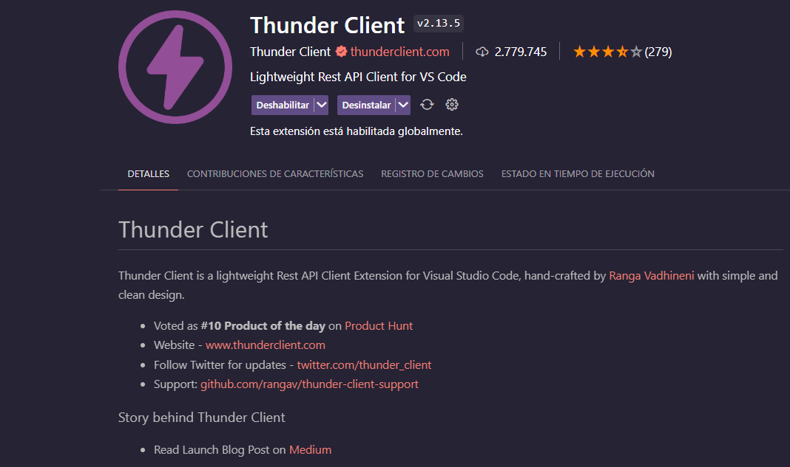
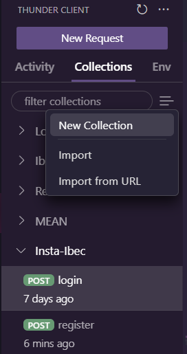
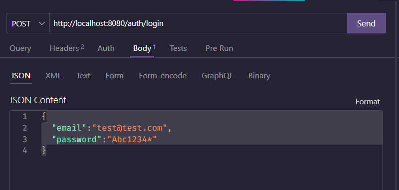

# Crear un servidor con Express JS

Express JS es un framework para Node JS que permite crear servidores web de manera sencilla.
Antes de Express JS, crear un servidor web con Node JS era un proceso largo y tedioso, ya que se debía crear el servidor desde cero, y configurar cada una de las rutas y métodos HTTP que se iban a utilizar.

## Requisitos

Para poder seguir este tutorial, es necesario tener instalado Node JS y NPM.

Ingresa a la página oficial de Node JS y descarga la versión LTS (Long Term Support) para tu sistema operativo.
https://nodejs.org/es

## Crear un proyecto

Para crear un proyecto con Express JS, vamos a ubicarnos en la carpeta donde queremos crear el proyecto y ejecutamos el siguiente comando:

```bash
npm init
```

Este comando nos va a pedir una serie de datos para configurar el proyecto, como el nombre, la versión, la descripción, el autor, etc.

```bash
Press ^C at any time to quit.
package name: (insta-server092023) instaserver
version: (1.0.0)                                                                                                      
description: Servidor de Instagram                                                                                    
entry point: (index.js)                                                                                               
test command:                                                                                                         
git repository:                                                                                                       
keywords:                                                                                                             
author: Josue Oroya                                                                                                   
license: (ISC)                                                                                                        
About to write to C:\devfiles\Ibec\Backend\insta-server092023\package.json:

{
  "name": "instaserver",
  "version": "1.0.0",
  "description": "Servidor de Instagram",
  "main": "index.js",
  "directories": {
    "doc": "docs"
  },
  "scripts": {
    "test": "echo \"Error: no test specified\" && exit 1"
  },
  "author": "Josue Oroya",
  "license": "ISC"
}


Is this OK? (yes) yes
```

Una vez que terminemos de configurar el proyecto, se creará un archivo llamado `package.json` con la configuración que acabamos de ingresar.

El paquete `package.json` es un archivo que contiene la información del proyecto, como el nombre, la versión, la descripción, el autor, las dependencias, etc. Se puede decir que este archivo es la hoja de vida del proyecto.

## Instalar Express JS

Para instalar Express JS, ejecutamos el siguiente comando:

```bash
npm install express
```

Veremos entonces que se crea una carpeta llamada `node_modules` y dentro de ella se instala el paquete de Express JS.

Verás además que se instalaron muchas otras dependencias, que son las dependencias de Express JS.

También se registro en el package.json la dependencia de Express JS en un propiedad llamada `dependencies`.

## Crear el servidor

Para crear el servidor con Express JS, vamos a crear un archivo llamado `index.js` y vamos a escribir el siguiente código:

```js
// 1. Importamos la librería de express
const express = require('express');

// 2. Creamos una instancia de express
const app = express(); // app es una instancia de express

// app es un objeto que tiene métodos, uno de ellos es get el cual recibe dos parámetros (ruta, callback)
// * un callback es una función que se pasa por parámetro a otra función.

// 3. Definimos una ruta y un callback (http://localhost:8080/)
app.get('/', (req, res)=>{
    res.send('<h1 style="color:white; background-color:#000000">Hola mundo</h1>');
})

const PORT = 8080; // PORT será una constante que contendrá el número de puerto en el que va a escuchar el servidor

// 4. Definimos el puerto en el que va a escuchar el servidor
app.listen( PORT, ()=>{
    console.log(`Servidor escuchando en el puerto ${PORT}`)
})

```

* 1. Importamos la librería de express
* 2. Creamos una instancia de express
* 3. Definimos una ruta y un callback (http://localhost:8080/)
* 4. Definimos el puerto en el que va a escuchar el servidor

### Consultas http:

Existen muchos tipos de consultas HTTP que se pueden realizar, las cuales apuntan a diferentes objetivos. Las más comunes son:

- GET: Se utiliza para obtener información del servidor.
- POST: Se utiliza para enviar información al servidor.
- PUT: Se utiliza para actualizar información en el servidor.
- DELETE: Se utiliza para eliminar información del servidor.

### CRUD (Create, Read, Update, Delete) o ABM (Alta, Baja, Modificación)

El CRUD es un acrónimo que significa Create, Read, Update, Delete, y se utiliza para referirse a las operaciones básicas que se pueden realizar sobre una base de datos.

### Rutas

* Ruta Raiz: / ---> http://localhost:8080/
* Ruta de Usuarios: /users ---> http://localhost:8080/users

## Actualización constante de cambios en el servidor

Como hemos visto, para ver reflejados los cambios en el servidor, debemos detener el servidor y volverlo a ejecutar. Esto a la larga es un proceso tedioso y poco práctico.

Para evitar esto, podemos utilizar una librería llamada `nodemon`, la cual se encarga de detectar los cambios en el código y reiniciar el servidor automáticamente.

Para instalar `nodemon`, es necesario instalarlo de dos formas, la primera como dependencia global y la segunda como dependencia de desarrollo:

```bash
npm install -g nodemon
```

* -g significa que la dependencia se instalará de forma global, es decir, que se podrá utilizar en cualquier proyecto de Node JS.

```bash
npm install -D nodemon
```

* -D significa que la dependencia se instalará como dependencia de desarrollo, es decir, que solo se utilizará en el entorno de desarrollo, pero no en el entorno de producción.
* -D es lo mismo que --save-dev
* Si vemos nuestro package.json, veremos que se ha agregado una nueva propiedad llamada `devDependencies` con la dependencia de `nodemon`.

Una vez instalado `nodemon`, podemos ejecutar el servidor con el siguiente comando:

```bash
nodemon index.js
```

## Crear respuestas más complejas

Para poder crear respuestas más complejas, implementaremos en nuestro callback el cual se ejecuta una vez que se recibe la consulta. En este ejemplo veremos como se envía un número a través de una req.params y como se envía una respuesta dependiendo del valor de la req.params.

```js
app.get('/age/:age', (req, res)=>{

   if(req.params.age < 18){
      return res.send('Eres menor de edad');
   }
  
   return res.send('Eres mayor de edad');

});
```

* En este ejemplo, estamos enviando un número a través de la ruta, y dependiendo del valor de ese número, se envía una respuesta u otra.
* Para enviar un número a través de la ruta, debemos utilizar `:` y luego el nombre de la variable que queremos enviar.
* Para obtener el valor de la variable, debemos utilizar `req.params.nombreVariable`.
* Para enviar una respuesta, debemos utilizar `res.send('mensaje')`.
* Para enviar una respuesta y detener la ejecución del código, debemos utilizar `return res.send('mensaje')`.

## Método POST

Para poder enviar información al servidor, debemos utilizar el método POST. En este caso usaremos la extensión Thunder Client para enviar las consultas.



Solo basta con dirigirse a la sección de extensiones de VS Code y buscar Thunder Client, luego instalarla y recargar VS Code.

Para poder usar Thunder Cliente, se recomienda crear una colección de consultas de la siguiente forma



Luego, crearemos una nueva request o consulta, y la guardaremos en la colección que acabamos de crear. En este caso, la consulta se llamará `Crear Usuario`.



Cuando le damos en send, estaremos enviando el cuerpo de la consulta el la propiedad req.body que recibe la función callback o controladora.


```json
{
  "email":"test@test.com",
  "password":"Abc1234*",
  "firstName":"test",
  "lastName":"test",
  "role":"USER_ROLE",
  "image":"/dded/deded.png",
  "bio":"Lorem ipsum dolor...",
  "followers":540,
  "following":900
}
```
