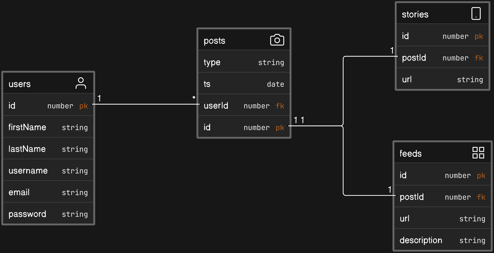
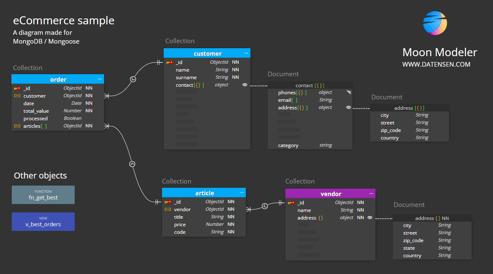

# MongoDB

Cuando hablamos de bases de datos, nos referimos a un conjunto de datos organizados y relacionados entre sí, los cuales son recolectados y almacenados en un sistema de forma estructurada, para que posteriormente puedan ser accedidos y utilizados por los usuarios.

Existen dos grandes categorías de bases de datos:

- Bases de datos relacionales (SQL)
- Bases de datos no relacionales (NoSQL)

## Bases de datos relacionales (SQL)

Las bases de datos relacionales son aquellas que almacenan los datos en tablas, las cuales están estructuradas por filas y columnas. Cada fila de la tabla representa un registro, mientras que las columnas representan los atributos de dicho registro.

### Pros y contras de las bases de datos relacionales

#### Pros

- Son muy estables y confiables.
- Son muy rápidas para realizar consultas.
- Son muy seguras.

#### Contras

- Son difíciles de escalar.
- Son difíciles de cambiar.
- Son difíciles de aprender.

## Bases de datos no relacionales (NoSQL)

Las bases de datos no relacionales son aquellas que almacenan los datos en documentos, los cuales están estructurados en pares de clave-valor. Cada documento puede tener una estructura diferente, lo que hace que la integración de los datos en ciertas aplicaciones sea más fácil y rápida.

### Pros y contras de las bases de datos no relacionales

#### Pros

- Son muy fáciles de escalar.
- Son muy fáciles de cambiar.
- Son muy fáciles de aprender.
- Son muy flexibles.

#### Contras

- Son menos estables y confiables.
- Son más lentas para realizar consultas.
- Son menos seguras.

En este curso veremos bases de datos NoSQL, específicamente MongoDB.

## MongoDB

MongoDB es una base de datos NoSQL, orientada a documentos y de código abierto. Esto quiere decir que no se basa en tablas, sino en documentos JSON con esquemas dinámicos, lo que hace que la integración de los datos en ciertas aplicaciones sea más fácil y rápida.

Mongo se puede usar de forma local o en la nube, y es compatible con la mayoría de los lenguajes de programación, como JavaScript, Python, PHP, Java, C#, C++, Ruby, Go, Scala, Swift, entre otros.

En este caso vamos a usar MongoDB Atlas, que es la versión en la nube de MongoDB. Para esto haremos clic en el botón [Prueba Gratuita], y posteriormente nos registraremos con nuestra cuenta de Google.
